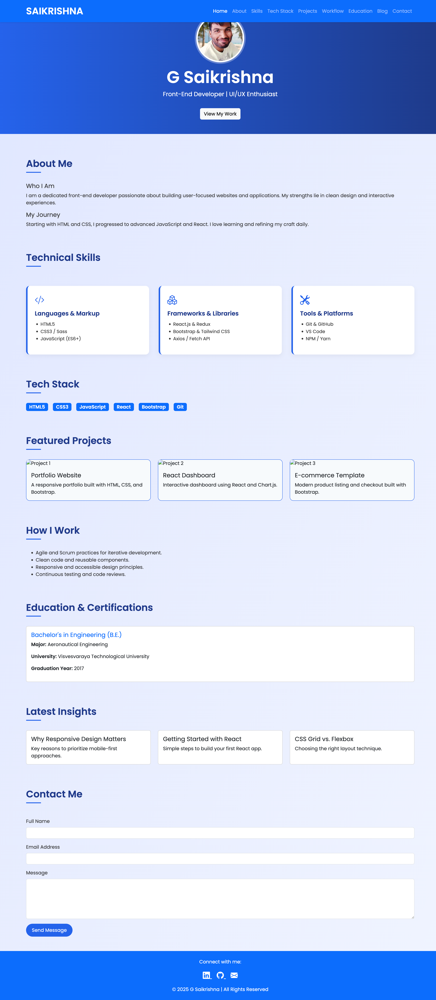

# 🌐 G Saikrishna - Front-End Developer Portfolio

Welcome to my personal developer portfolio — crafted with modern technologies, clean UI/UX, and a blue-themed responsive design.


## 🔗 Live Demo

🌍 **Hosted on GitHub Pages:**  
➡️ [View Portfolio](https://saikrishna261996.github.io/portfolio-website/)

---

## 📌 Table of Contents

- [About](#about)
- [Features](#features)
- [Tech Stack](#tech-stack)
- [Projects](#projects)
- [Screenshots](#screenshots)
- [Setup Instructions](#setup-instructions)
- [Connect With Me](#connect-with-me)

---

## 🧑‍💻 About

I'm **G Saikrishna**, a passionate front-end developer focused on building elegant, user-friendly web interfaces using **HTML, CSS, JavaScript, React**, and **modern UI libraries**.

This project is a portfolio that showcases my technical skills, development workflow, projects, blogs, and contact information — all in a clean and responsive design built with a consistent blue theme.

---

## ✨ Features

✅ Blue theme-based elegant UI  
✅ Mobile-responsive layout  
✅ Bootstrap 5 + Flexbox & Grid  
✅ Reusable skill & project cards  
✅ Scrollable navigation bar  
✅ Fully modular and expandable  
✅ Deployed via GitHub Pages  

---

## 🛠 Tech Stack

| Category              | Technologies                                |
|-----------------------|---------------------------------------------|
| 💻 Languages          | HTML5, CSS3, JavaScript (ES6+)              |
| 📦 Frameworks         | Bootstrap 5, React.js (future integration) |
| 🎨 Libraries          | Bootstrap Icons, Google Fonts (Poppins, Inter) |
| 🛠 Tools & Platforms  | Git, GitHub, VS Code, GitHub Pages          |

---

## 🚀 Projects

### 📁 Portfolio Website  
A fully responsive portfolio built using Bootstrap, HTML & CSS.

### 📁 React Dashboard (Coming Soon)  
An interactive dashboard powered by React and Chart.js.

### 📁 E-Commerce Template  
A front-end layout for a product listing and checkout page.

---

## 🖼️ Screenshot




---

🔗 Connect With Me

Feel free to reach out or follow me on my professional networks:

👔 LinkedIn(https://www.linkedin.com/in/saikrishna-g-172253239/)

💻 GitHub(https://github.com/saikrishna261996)

📧 Email: saikrishna261996@gmail.com
## ⚙️ Setup Instructions

To run this locally:

```bash
# Clone the repo
git clone https://github.com/saikrishna261996/portfolio-website.git

# Go into the directory
cd portfolio-website

# Open index.html in your browser
